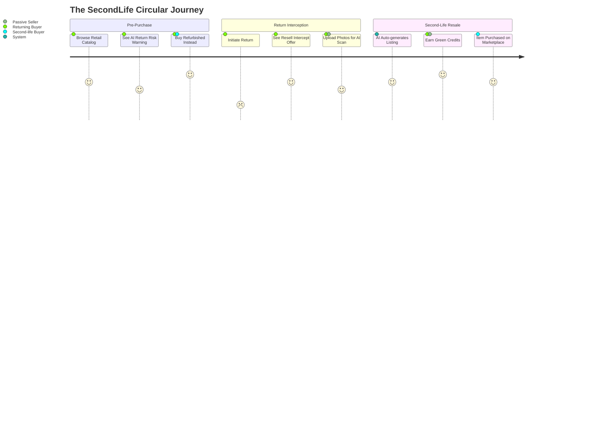
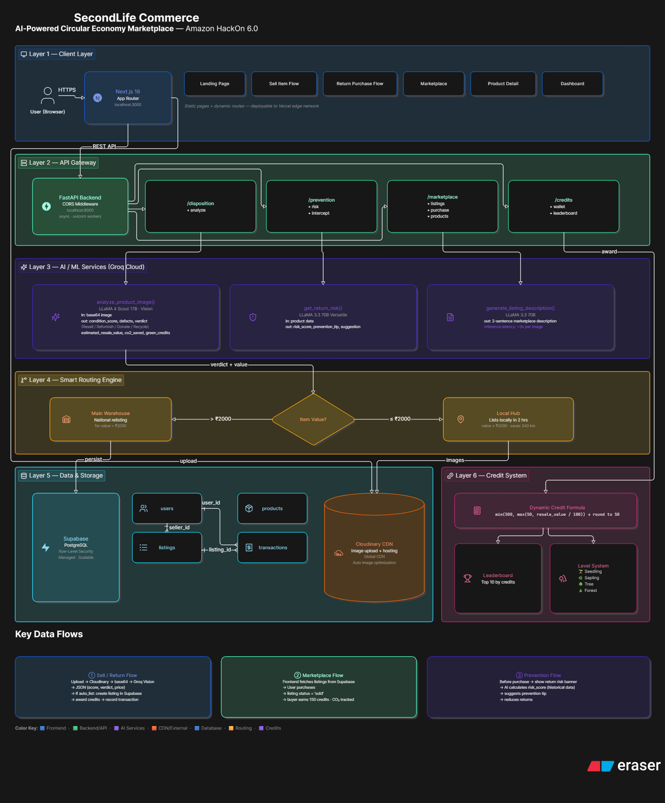

<div align="center">
  <h1>🌿 SecondLife</h1>
  <p><strong>AI-Powered Returns & Sustainable Resale</strong></p>

  [](https://secondlife-blue.vercel.app/)
  [](https://tinyurl.com/4638wan5)
  [](https://github.com/avnii-goel/HackOn)
</div>

<br/>

## 🚨 The Problem

Consumers returned products worth **$890 billion globally in 2024**, generating up to **4.2 kg of CO₂ per return**. Traditional e-commerce treats returns as a dead-end logistics problem:
* **For Sellers:** Absorbing processing costs that can reach two-thirds of the item's original price.
* **For The Planet:** 9.5 billion pounds of returned goods end up in landfills annually.
* **For Buyers:** Earning nothing but a refund, missing out on potential resale value.

---

## 💡 The Solution: SecondLife Commerce

SecondLife Commerce is a circular-economy layer for Amazon India that turns product returns into value instead of waste. It intercepts the return moment and converts the customer into a seller of a verified second-life listing. 

We solve these pain points by intervening at three critical moments:
1. **Preventing Returns (Pre-purchase):** An AI return-risk scoring banner warns buyers *before* they make a mistake using historical return patterns.
2. **Intercepting Returns (At return initiation):** The system intercepts the return with a personalized resell offer, showing the customer exactly what they would earn by listing instead of returning.
3. **Automating Resale (Post-return):** Computer vision grades the item's condition from uploaded photos in seconds, auto-generates a verified listing, calculates CO₂ saved, and rewards users with Green Credits.

> **The Core Insight:** The return initiation moment is the highest-intent moment to convert a customer into a seller. The platform captures it automatically, inside a trusted ecosystem, with zero friction.

---

## 👥 User Workflow

The platform caters to three target users within a unified circular ecosystem:
1. **Returning buyer** (recovers value instead of just a refund)
2. **Second-life buyer** (wants verified refurbished goods, doesn't trust classifieds)
3. **Passive seller** (has unused items but finds resale platforms slow/risky)



---

## 🏗 System Architecture

SecondLife Commerce is a fully stateless monorepo built for high performance and horizontal scalability.

<div align="center">
  
</div>

### Tech Stack Details

| Layer | Technology |
|-------|-----------|
| **Frontend** | Next.js 16.2.9 (App Router), React 19.2.4, TypeScript 5 |
| **Styling** | Tailwind CSS 4 (`@tailwindcss/postcss`), custom CSS properties, Dark Mode via `next-themes` |
| **UI Libs** | `framer-motion`, `lucide-react`, `react-hot-toast`, `react-dropzone` |
| **Backend** | FastAPI (Python), `uvicorn`, `python-multipart`, `httpx`, `pillow` |
| **Database** | Supabase (PostgreSQL) — 4 Core Tables (`users`, `products`, `listings`, `transactions`) |
| **Vision AI** | Groq + `meta-llama/llama-4-scout-17b-16e-instruct` (image condition grading) |
| **Text AI** | Groq + `llama-3.3-70b-versatile` (return-risk scoring + listing descriptions) |
| **Image CDN** | Cloudinary |
| **Deployment**| Vercel (Frontend) & Render (Backend) |

### Key Algorithms & Scaling
- **Stateless Backend:** No sessions. Any number of FastAPI instances run in parallel with no coordination overhead.
- **Dynamic Credit Scoring:** `min(500, max(50, estimated_resale_value / 100))` rounded to nearest 50. Ensures economically rational incentives.
- **Vision-First Grading:** The model analyzes what it actually sees, not what the user claims. Sellers cannot self-report condition.
- **Two-Phase Listing:** API supports `auto_list=false` to preview AI results, and `auto_list=true` on confirmation to build seller trust.
- **Smart Routing:** High-value items route to main warehouse for national relisting. Low-value items route to the nearest local hub, eliminating unnecessary long-haul reverse logistics.

---

## 🚀 How to Run Locally

### 1. Clone the repository
```bash
git clone https://github.com/avnii-goel/HackOn.git
cd HackOn
```

### 2. Backend Setup
```bash
cd backend
pip install -r requirements.txt
```
Create a `.env` file in the `backend/` directory with your secrets:
```env
GROQ_API_KEY=your_key
SUPABASE_URL=your_url
SUPABASE_KEY=your_service_key
CLOUDINARY_CLOUD_NAME=your_cloud_name
CLOUDINARY_API_KEY=your_api_key
CLOUDINARY_API_SECRET=your_api_secret
```
Run the FastAPI server:
```bash
uvicorn main:app --reload --port 8000
```
*(API runs at http://localhost:8000. Docs at http://localhost:8000/docs)*

### 3. Frontend Setup
```bash
cd ../frontend
npm install
```
Create a `.env.local` file in the `frontend/` directory:
```env
NEXT_PUBLIC_SUPABASE_URL=your_supabase_url
NEXT_PUBLIC_SUPABASE_ANON_KEY=your_anon_key
NEXT_PUBLIC_CLOUDINARY_CLOUD_NAME=your_cloud_name
NEXT_PUBLIC_API_URL=http://localhost:8000
```
Run the Next.js development server:
```bash
npm run dev
```
*(App runs at http://localhost:3000)*

---

## 🔮 Future Vision

SecondLife Commerce launches as a returns and resale layer for Amazon India. Within three years it becomes the infrastructure for circular commerce across every Amazon marketplace globally: a condition-grading and routing engine that sellers, logistics partners, and third-party platforms plug into via API to handle second-life inventory at scale.

**Roadmap:**
* **0-3 months:** Full platform live in India. Onboard early sellers via Amazon seller program.
* **3-6 months:** Native integration with Amazon's return portal as a default interception step. Refurbishment partner network live.
* **6-12 months:** Expand to Amazon US and EU. Launch B2B disposition API for bulk seller returns.

---

## 👥 Team WeVibe

| Name | Role | University | Contact |
| --- | --- | --- | --- |
| **Shourya Agrawal** | Backend Dev | Guru Gobind Singh Indraprastha University | shouryagrawal0007@gmail.com |
| **Avni Goel** | Frontend Dev | Guru Gobind Singh Indraprastha University | avnigoel.2005@gmail.com |

<br/>
<div align="center">
  <i>Built with 💚 for HackOn with Amazon</i>
</div>